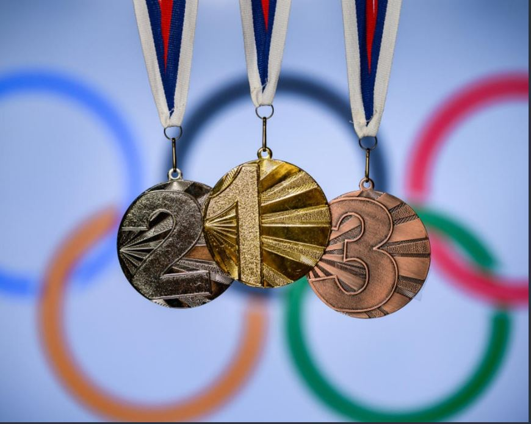

# Olympic Podium Projections

# Note:
check the documentation of this project to know more about my workflow

# Model Evaluations
|   | LinearRegressor | DecisionTreeRegessor| RandomForestRegressor | GradientBoostRegressor |
|:-:|:--:|:---:|:---:|:---:|
| MAE | 0.6966 | 0.104 | 0.309 | 0.674 |
| RMSE | 0.822 | 0.284 | 0.393 | 0.791 |
| R2 | 0.0025 | 0.880 | 0.771 | 0.077 |

from the evaluations above, RandomForestRegressor and DecisionTreeRegessor were the best performing algorithms with DecisionTreeRegessor as best performed

# CONCLUSION & RECOMMENDATION

By following these steps, we trained and evaluated multiple models to identify the most accurate and
reliable model for making predictions or gaining insights from the Olympic athletes' data.
Based on the insights gained from the analysis, we provide recommendations for various stakeholders.
This may include suggestions for athlete training, team selection, resource allocation, or strategic
decision-making. Recommendations should be practical and actionable, considering the context of the
Olympic Games and the available data.
This stage wraps up the project by summarizing the main findings, highlighting the best-performing
model, and providing actionable recommendations.
It ensures that the analysis has addressed the project objectives and has generated valuable insights
that can inform decision-making in the context of Olympic sports.
